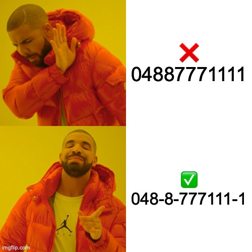

# Bank account formatter
A simple format bank account address to look pretty 🤠


**Look pretty good huh**

## Installtion
```sh
# NPM
npm install git+https://github.com/mrwan200/bank-account-formatter
# Yan
yarn add git+https://github.com/mrwan200/bank-account-formatter
# PNPM
pnpm install git+https://github.com/mrwan200/bank-account-formatter
```

# Example useage
```js
const { parse } = require("./dist")

const VALUE = "0488711222"
console.log(`KBANK result: ${parse(VALUE, "kbank")}`);
console.log(`SCB result: ${parse(VALUE, "scb")}`);
console.log(`KTB result: ${parse(VALUE, "scb")}`);

// Or you can set strict mode to true if you not want someone has human error input
console.log(`GSB result: ${parse(VALUE + '211', "gsb", true)}`); // Input length 12
console.log(`GSB result: ${parse(VALUE, "gsb", true)}`); // Input length 10, But GSB need input length 12 digist
console.log(`KBANK result: ${parse('12345', "kbank", true)}`); // Input length 5, But BAAC need input length 10 digist
console.log(`KBANK result: ${parse('abc', "kbank", true)}`); // Input length 3 + aplhabet, But any bank doesn't support aplhabet account address 
```

## Reference
- From APP: (KBANK, KTB, MyMo)
- [รายชื่อธนาคารในประเทศไทย](https://th.wikipedia.org/wiki/รายชื่อธนาคารในประเทศไทย)
- [KKP Image](https://www.truemoney.com/startsaving/)
- [TISCO Address](https://www.tiscosec.com/th/ats.html)
- [UOB Presentation (Page 3)](https://www.uob.co.th/web-resources/pdf/personal/deposits/user-manual-one-account-uob-mighty-aug21.pdf)
- Another site with include bank account address

## LICENSE
[MIT](./LICENSE)